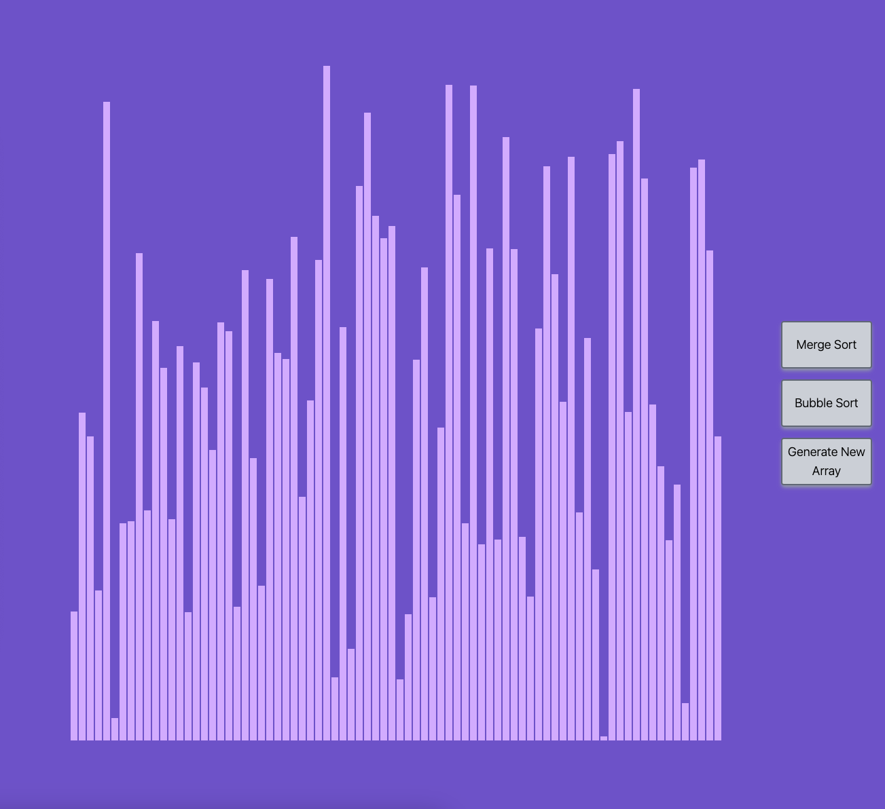

# Sorting Algorithm Visualiser created with React + Vite

- A simple single-page app created with React + Vite to visually demonstrate different types of sorting algorithms
- Merge Sort correctly functions but at this point is not a visually animated process
- Bubble Sort functions and the process is demonstrated with visual animations
- Plans to integrate more types of sorting algorithms with animations

## Libraries & Frameworks
- TailwindCSS

## Screenshots

#### Unsorted

#### Sorted

#### Bubble Sort: Sorting
