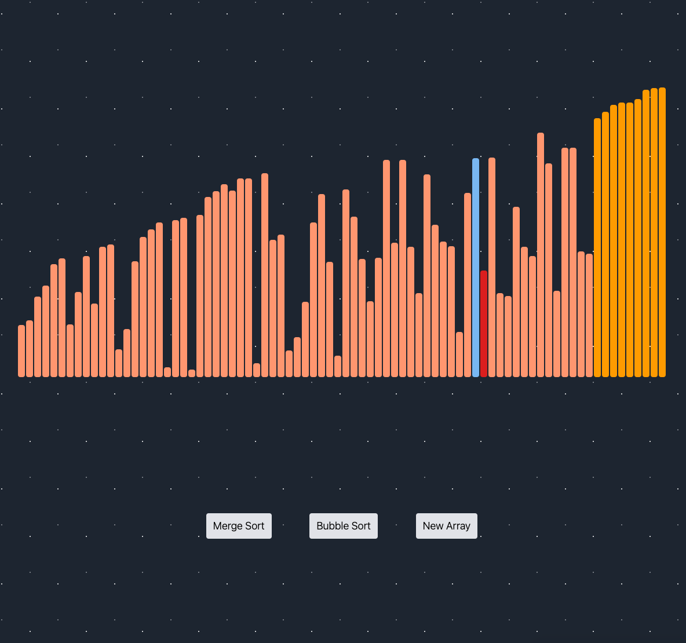

# Sorting Algorithm Visualiser created with React + Vite

- A dynamic web app to visually demonstrate how various sorting algorithms work
- Built with ReactJS and styled using TailwindCSS
- Allows users to select different sorting algorithms, change the speed at which the sorting happens

## Plans
- Animate merge sort
- Integrate more types of sorting algorithms with animations
- Sorting speed toggle
- Stop/restart when sorting is in progress

## Screenshots

#### Bubble Sort: Sorting

#### Sorted
